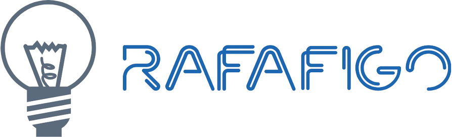

# Rafael's Portfolio
#### Source code for my personal portfolio website

---

## 🚀 Quick Start

### Prerequisites
- Node.js (v14 or higher)
- npm (comes with Node.js)

### How to run locally
```bash
# Install dependencies
npm install

# Start development server (default port 3000)
npm start

# Or run on a custom port
PORT=3001 npm start  # Mac/Linux
$env:PORT=3001; npm start  # Windows PowerShell
```

The website will automatically open at `http://localhost:3000` (or your custom port).

### How to build for production
```bash
npm run build
```

### How to deploy to GitHub Pages
```bash
npm run deploy
```

---

## ✨ Features

- 🎨 Modern, clean design with glass-morphism effects
- 🌓 Dark/Light mode toggle
- 📱 Fully responsive across all devices (mobile, tablet, desktop)
- 🎯 Smooth animations and micro-interactions
- ⚡ Fast loading and optimized performance
- ♿ Accessible design (WCAG compliant)
- 🎭 Interactive skill cards with icons
- 📅 Timeline-based experience section
- 🔗 Social media integration

## 🛠️ Built With

- React 18
- TypeScript
- Material-UI (MUI) v5
- Framer Motion
- React Scripts

## 📄 License

This project is Licensed under the MIT License

---

Made with ❤️ by Rafael Figueiredo